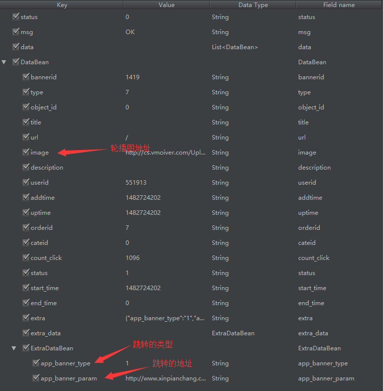
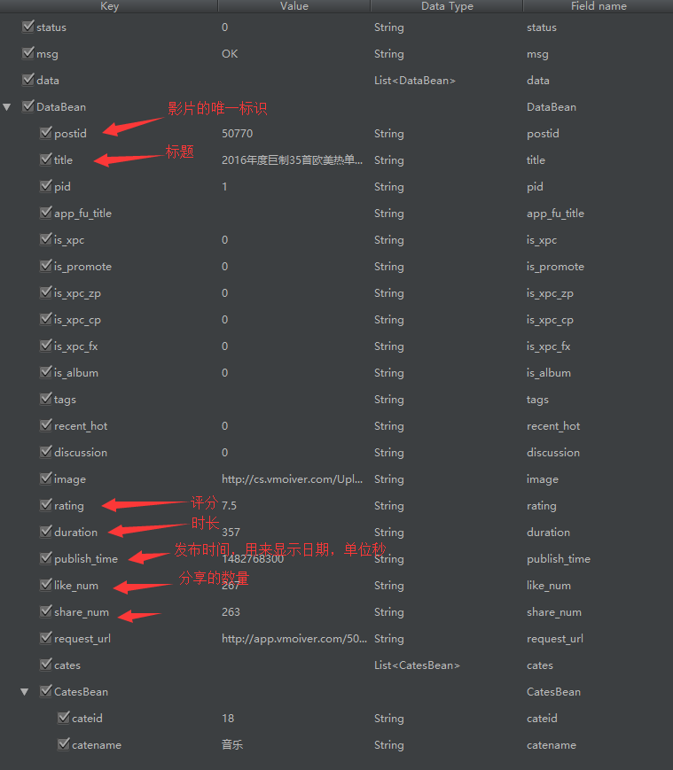
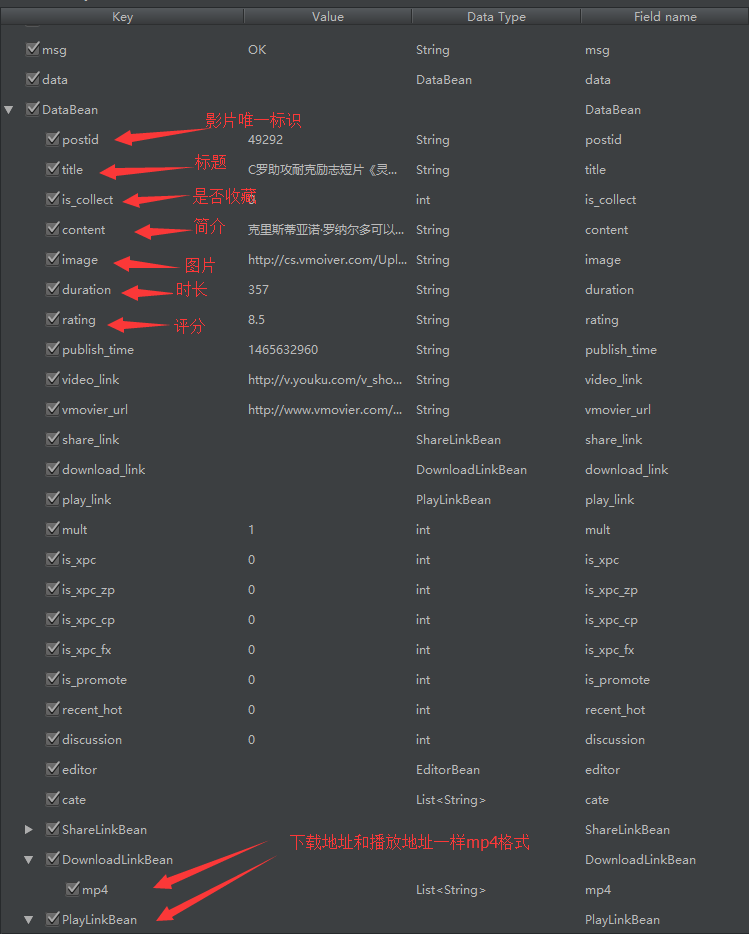
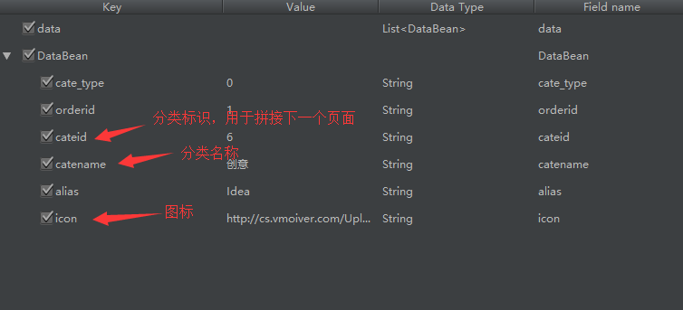
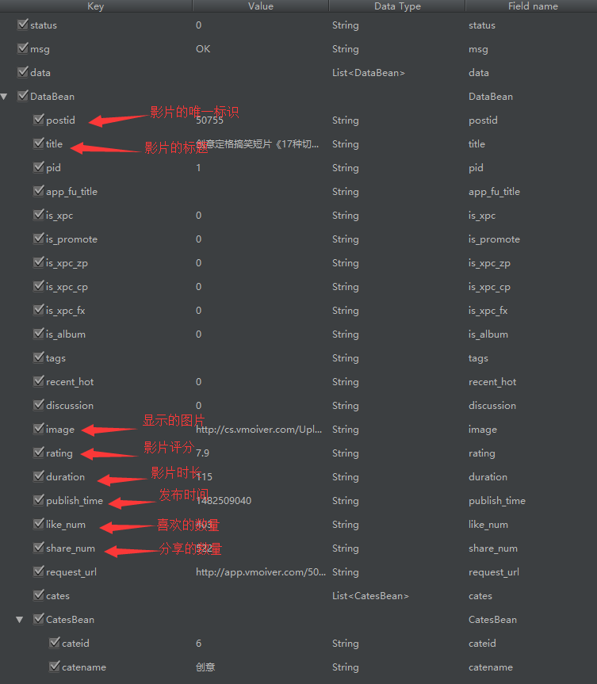
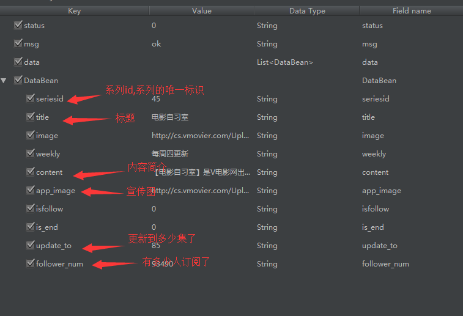
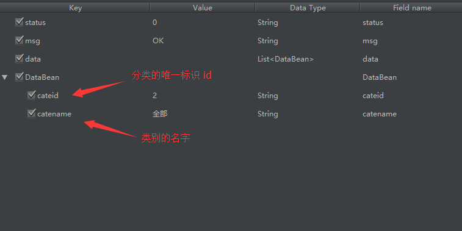
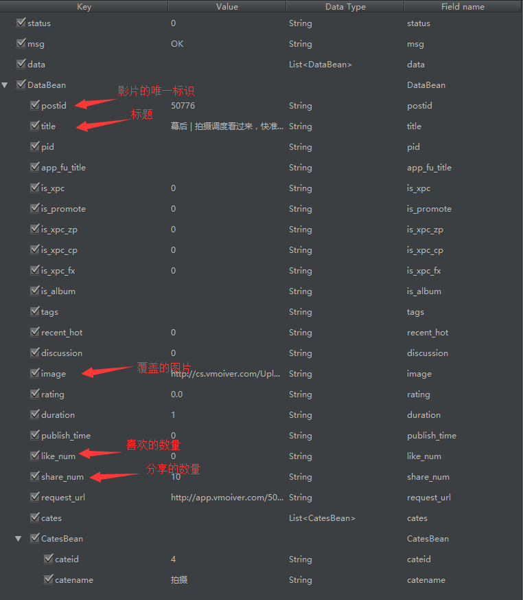

# VMovie #

## App的根地址 ##

```
host:  app.vmoiver.com
```


### 首页轮播图 ###

```
path:   /apiv3/index/getBanner
```


### 首页最新电影列表 ###

```
path:   /apiv3/post/getPostByTab

```

    参数 | 是否必须
     --- |---
      p  |  NO  分页加载肯定会用到的，最好传递
    size |  NO  默认值10



### 电影列表详情 ###
- 可以说这个是个例外
```
host:   apiv2.vmovier.com
path:   /api/post/view
web :   app.vmoiver.com/postid?qingapp=app_new
```

     参数 | 是否必须
     ---  |  ---
    postid|  YES用来显示不同的电影详情,包含播放信息



### 频道列表 ###

```
path:  /apiv3/cate/getList

```


### 频道详情 ###

```
path:   /apiv3/post/getPostInCate
```

      参数 | 是否必须
       --- |---
      p    |  NO  分页加载肯定会用到的，最好传递
    size   |  NO  默认值10，每一页的数据条数
    cateid |  NO


### 频道热门和专辑 ###

```
path:   /apiv3/post/getPostByTab
```

      参数 | 是否必须
       --- |---
      p    |  NO  分页加载肯定会用到的，最好传递
    size   |  NO  默认值10，每一页的数据条数
    tab    |  YES
返回和其它频道没区别，就是请求拼接的时候有点小差别


### 系列 ###

```
path:   /apiv3/series/getList
```

    参数 | 是否必须
     --- |---
      p  |  NO  分页加载肯定会用到的，最好传递
    size |  NO  默认值10，每一页的数据条数

### 系列详情页面 ###

```
path:   /apiv3/series/view
```

      参数  | 是否必须
       ---  |---
    seriesid|  YES,拼接要显示的系列信息的seriesid

### 幕后顶部导航 ###

```
path:   /apiv3/backstage/getCate
```

### 幕后内容区 ###

```
path:   /apiv3/backstage/getPostByCate
```

      参数 | 是否必须
       --- |---
      p    |  NO  分页加载肯定会用到的，最好传递
    size   |  NO  默认值10，每一页的数据条数
    cateid |  NO  默认值2，默认获取全部

### 幕后内容详情 ###

```
path:   /apiv3/post/view
```

      参数 | 是否必须
       --- |---
     postid|  YES,拼接要显示的影片信息的postid
和电影详情是一致的


### 幕后内容详情Web ###
```
host and path:
    app.vmoiver.com/postid?qingapp=app_new
```

      参数 | 是否必须
       --- |---
     postid|  YES,拼接要显示的影片信息的postid
WebView显示